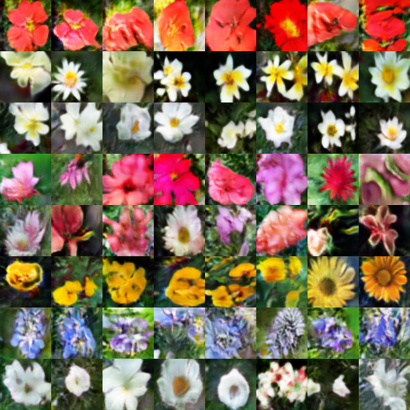
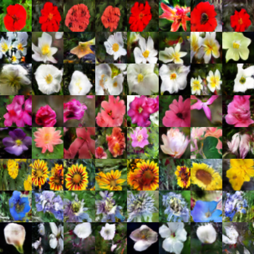

# Text2Image
* Goal : In terms of specific text description to generate corresponding images.
* TensorFlow implement for [Kaggles Contest - Reverse Image Caption](https://www.kaggle.com/c/datalabcup-reverse-image-caption-ver2/leaderboard)
* Technique: Using `GAN-CLS` algorithm from the paper [Generative Adversarial Text-to-Image Synthesis](http://arxiv.org/abs/1605.05396) and `stackGAN++` model from [StackGAN++: Realistic Image Synthesis with Stacked Generative Adversarial Networks](https://arxiv.org/abs/1710.10916)

## Inference Result 
* the flower shown has yellow anther red pistil and bright red petals.
* this flower has petals that are yellow, white and purple and has dark lines
* the petals on this flower are white with a yellow center
* this flower has a lot of small round pink petals.
* this flower is orange in color, and has petals that are ruffled and rounded.
* the flower has yellow petals and the center of it is brown
* this flower has petals that are blue and white.
* these white flowers have petals that start off white in color and end in a white towards the tips.  

### Result after 200 epochs

### Result after 800 epochs

## My thoughts
### Pros
### Cons

* ## Reference
    * StackGAN++ PyTorch [paper](https://arxiv.org/abs/1710.10916) [code](https://github.com/hanzhanggit/StackGAN-v2)
